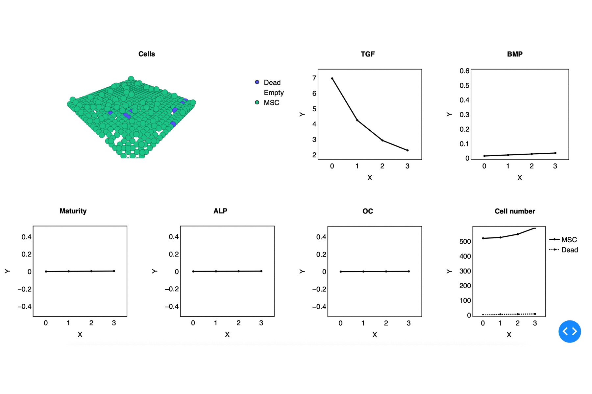

## Fuzzy agent-based modeling of mesenchymal stem cells (MSCs) proliferation and osteogenic differentiation in response to Magnesium (Mg) ions

## Content
The model consists of C++ and Python codes. The model is primarily written in C++ using CppyABM for agent-based modeling and -- for the fuzzy-logic controller. The breakdown of the folders are,

- `include` -> C++ include files 
- `src` -> C++ source files
- `bio_data` -> the empirical data used for the model calibration
- `parameters` -> the model's parameters
- `scripts` -> Python scripts

## Authors

- Jalil Nourisa

## Contributing to fuzzyABM
In case of encountering a problem in running the model, pls report it as an issue or contact the author (jalil.nourisa@gmail.com)

